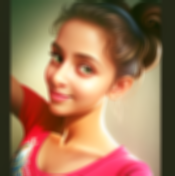
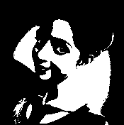
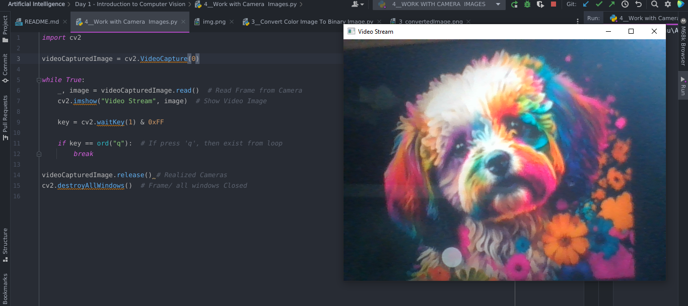

# Introduction to Computer Vision :

## Objectives 👼 : 

1. Reading, Resizing, Saving Image Using OpenCV | [Solution](https://github.com/sarangiWijemanna/Artificial-Intelligence-A.I-/blob/main/Day%201%20-%20Introduction%20to%20Computer%20Vision/1__Reading%2CResizing%2CSaving%20Image%20using%20OpenCV%20Example.py)
2. Smoothing Image Using OpenCV | [Solution](https://github.com/sarangiWijemanna/Artificial-Intelligence-A.I-/blob/main/Day%201%20-%20Introduction%20to%20Computer%20Vision/2__Smooth%20Image%20Example.py)
3. Convert Color Image to Binary Image Using OpenCV | [Solution](https://github.com/sarangiWijemanna/Artificial-Intelligence-A.I-/blob/main/Day%201%20-%20Introduction%20to%20Computer%20Vision/3__Convert%20Color%20Image%20To%20Binary%20Image.py)
4. How Capturing Live Camera Images Using OpenCV | [Solution](https://github.com/sarangiWijemanna/Artificial-Intelligence-A.I-/blob/main/Day%201%20-%20Introduction%20to%20Computer%20Vision/4__Work%20with%20Camera%20%20Images.py)


## Example Outputs 💞 :

| Example                                                                                                                                                                                                  | Input Image                                                   | Output Image                                                                   |
|----------------------------------------------------------------------------------------------------------------------------------------------------------------------------------------------------------|---------------------------------------------------------------|--------------------------------------------------------------------------------|
| [1](https://github.com/sarangiWijemanna/Artificial-Intelligence-A.I-/blob/main/Day%201%20-%20Introduction%20to%20Computer%20Vision/1__Reading%2CResizing%2CSaving%20Image%20using%20OpenCV%20Example.py) | <br/>175 x 176 | <br/>65 x 65          |
| [2](https://github.com/sarangiWijemanna/Artificial-Intelligence-A.I-/blob/main/Day%201%20-%20Introduction%20to%20Computer%20Vision/2__Smooth%20Image%20Example.py)                                       | <br/>175 x 176 | <br/>175 x 176 |
| [3](https://github.com/sarangiWijemanna/Artificial-Intelligence-A.I-/blob/main/Day%201%20-%20Introduction%20to%20Computer%20Vision/3__Convert%20Color%20Image%20To%20Binary%20Image.py)                  | <br/>175 x 176 | <br/>175 x 176      |
| [4](https://github.com/sarangiWijemanna/Artificial-Intelligence-A.I-/blob/main/Day%201%20-%20Introduction%20to%20Computer%20Vision/4__Work%20with%20Camera%20%20Images.py)                               | Video Capturing from Lap Cam                                  |           |

## Tech Stack  

<table>
    <tr>
        <td align="center" width="96">
          <a href="#macropower-tech">
            
          </a>
          <br>Python
        </td>  
        <td align="center" width="96">
            
          <br>OpenCV
        </td>
    </tr>
</table>

## Suggestions

Don't forget to leave feedback if you find this repo useful or any improvements. ⭐🌹🥧

Thank you 🧡


✨🤝 ```Pantech Solutions_INDIA``` ```Internship_AI``` 
