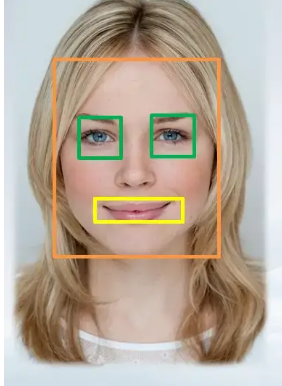
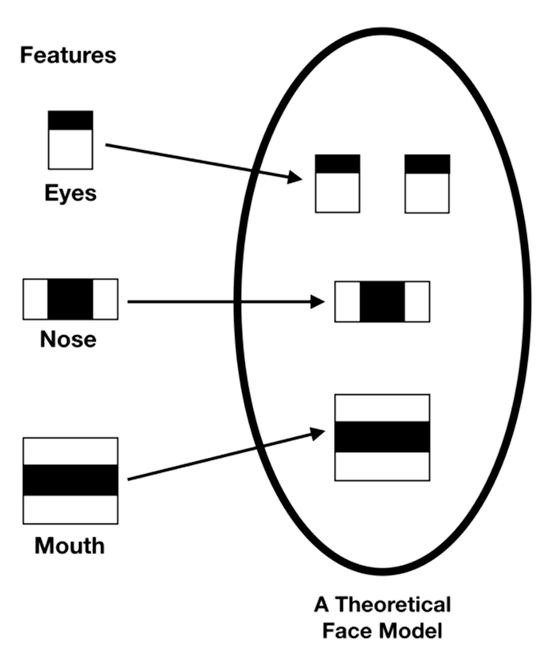
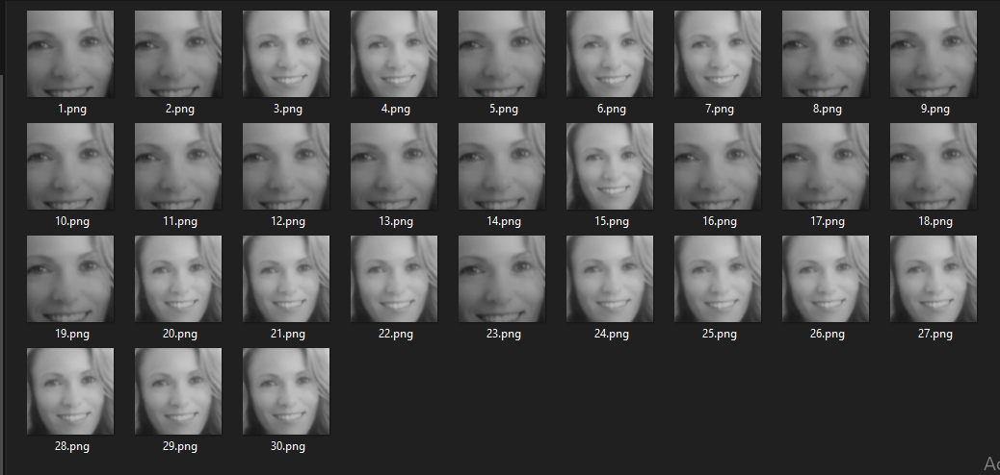

# Face detection & Tracking 👧👦👩👨

Face detection and tracking refer to the processes of detecting and tracking human faces in digital images or video streams.

Face detection involves detecting the presence of a human face within an image or video frame. This process typically involves using computer vision techniques to analyze the image and identify regions that match the characteristics of a human face.

Face tracking involves locating and following a specific human face as it moves around within a video stream or sequence of images. This process typically involves using computer vision techniques to estimate the position and orientation of the face in each frame of the video and track its movement over time.

Both face detection and tracking have numerous applications in various fields, including security and surveillance, human-computer interaction, video editing and special effects, biometric authentication, marketing and advertising, and healthcare.




## Algorithm : Haar Cascade Frontal-face Algorithm 

- Analysis of pixels in images into squares with the help of functions.
- The Haar Cascade Frontal-face algorithm is a machine learning-based object detection algorithm used for detecting human faces in digital images and videos. 
- It is a type of cascade classifier that uses Haar-like features and ```Adaboost Learning Algorithm``` to detect objects in an image. 
  - The algorithm works by sliding a window over an image and evaluating the presence of Haar-like features at each position. 
  - If the features match the patterns of a face, the algorithm marks the window as a potential face and moves on to the next window. 
  - The algorithm is trained on a large dataset of positive and negative images to learn the features that distinguish faces from other objects. 
  - The resulting classifier is then used to detect faces in new images. 
  - The Frontalface variant of the Haar Cascade algorithm is specifically trained for detecting frontal views of human faces.
  
    
    
  - ``detectMultiScale`` function is helped to detect the coordinated of the face.
    - ``
    faces = face_cascade.detectMultiScale(src, scalefactor,minNeighbors)
    ``

## Workflow : How Face Detection Works

```
    1. Loading HaarCascadeFace Algorithm 
    2. Initializing the Camera. 
    3. Reading Frame from Camera.
    4. Converting a Color image into Grayscale Image.
    (which helps to reduce processing time and remove color variations that may be affected to detect the face.)
    5. Obtaining Face coordinates by the passing algorithm. 
    6. Drawing Rectangle on the Face Coordinates.
    7. Display the output Frame.
```

## Application Example

1. [Face Detect]()


3. [Creating Face Dataset]()

Now, we want to save 30 captured images from the webcam to the local directory.


